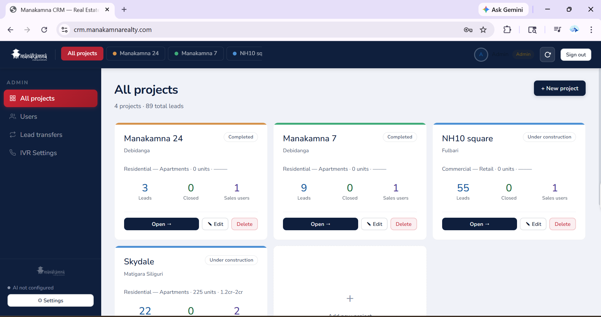
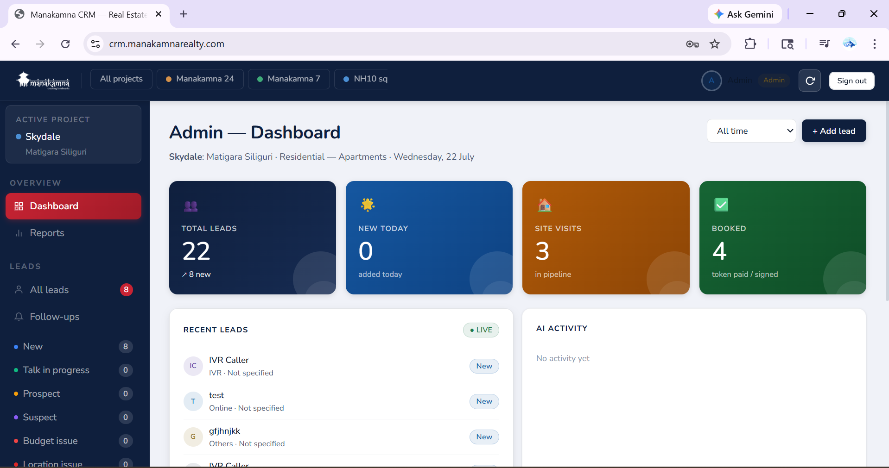
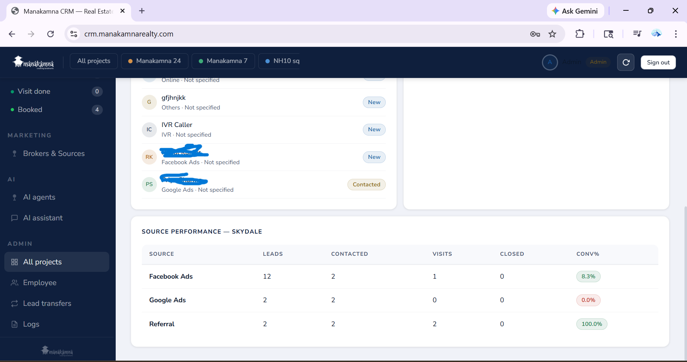
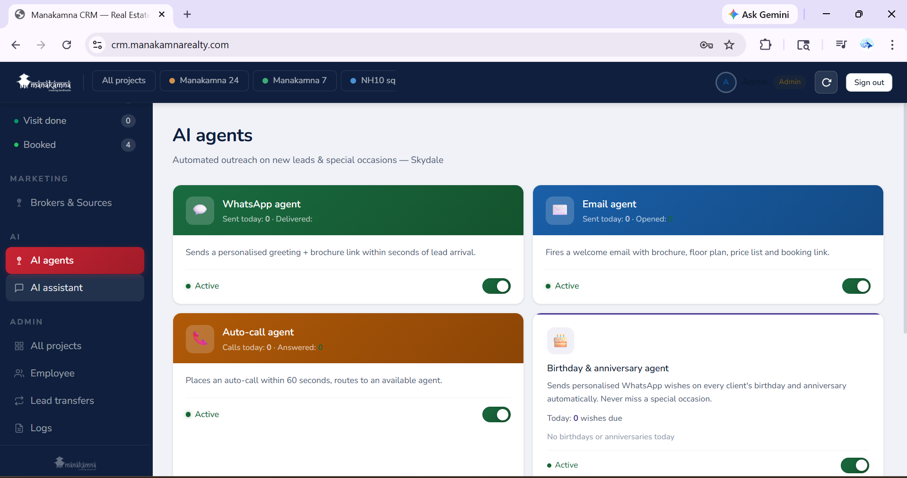
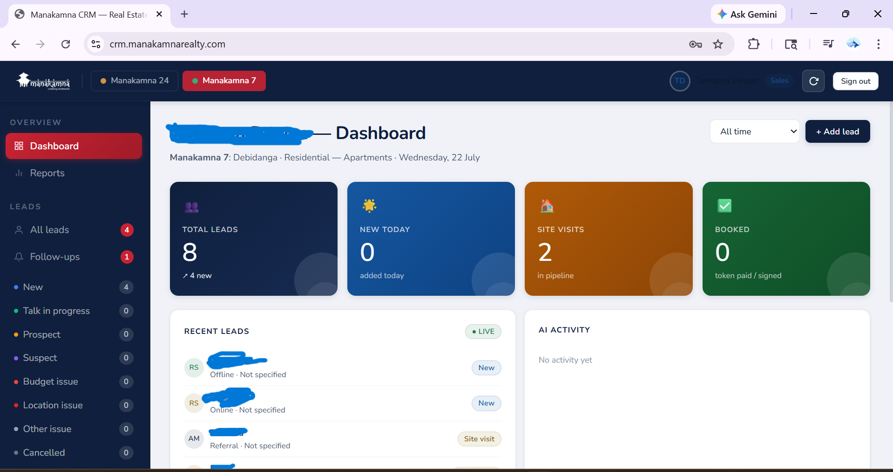

# multi-project-real-estate-crm
Multi-project real estate CRM with AI automation agents (WhatsApp, Email, Auto-Call, Birthday/Anniversary) built with React, Node.js, MySQL, and n8n. Screenshots and documentation for a live client project.

# Manakamna Realty CRM

A multi-project real estate CRM with integrated AI automation agents, 
built as a freelance project for Manakamna Realty to manage leads 
across multiple property developments from a single dashboard.

> Note: This repository contains screenshots and documentation only. 
> Source code is not included as this is a live client system with 
> proprietary business data.

## Overview

Manakamna Realty manages several ongoing property developments — 
Manakamna 24, Manakamna 7, NH10 Square, and Skydale. Before this system, 
lead follow-up across projects was manual and inconsistent.

This CRM brings all projects into one dashboard with automated lead 
response, so no lead waits for a human to notice it.

## Features

- **Multi-project management** — switch between or view combined stats 
  across multiple real estate projects from one admin dashboard
- **Lead pipeline tracking** — leads move through New → Talk in Progress 
  → Prospect → Site Visit → Booked, with issue tagging (Budget issue, 
  Location issue, Other issue, Cancelled)
- **AI Automation Agents:**
  - **WhatsApp Agent** — sends a personalized greeting + brochure link 
    within seconds of a new lead arriving
  - **Email Agent** — auto-sends a welcome email with brochure, floor 
    plan, price list, and booking link
  - **Auto-Call Agent** — places an automated call within 60 seconds 
    and routes to an available sales agent
  - **Birthday & Anniversary Agent** — sends personalized WhatsApp and Gmail
    wishes automatically on client birthdays/anniversaries
- **Real-time dashboard** — total leads, new-today count, site visits 
  in pipeline, and bookings, all live

## Tech Stack

React · Node.js · MySQL · n8n (automation workflows) · WhatsApp Business 
API · IVR integration for call routing

## Screenshots

## Screenshots

### All Projects Overview

Admin view showing all active real estate projects — Manakamna 24, 
Manakamna 7, NH10 Square, and Skydale — with lead counts and quick 
project actions.

### Project Dashboard

Real-time stats for an active project — total leads, new leads today, 
site visits in pipeline, and confirmed bookings.

### Lead Source Performance

Tracks lead source effectiveness (Facebook Ads, Google Ads, Referral) 
with contact rate, visit rate, and conversion percentage per source — 
helping the sales team and marketing team see what's actually working.

### AI Agents Panel

Four automation agents running for lead engagement — WhatsApp, Email, 
Auto-Call, and Birthday/Anniversary — each showing live activity status.

### Sales Team View

Role-based dashboard for individual sales team members, showing only 
their assigned leads and follow-ups — keeping the interface focused 
and relevant per role.
## My Role

I designed and built this system end-to-end — database schema, backend 
API, React frontend, and the n8n automation workflows connecting the 
CRM to WhatsApp, email, and voice calling.

## Contact

Rakhi Sau — Web Developer & Automation Specialist  
[LinkedIn](https://www.linkedin.com/in/rakhi-sau-87896824b/) · [Fiverr](https://fiverr.com/rakhisau)
